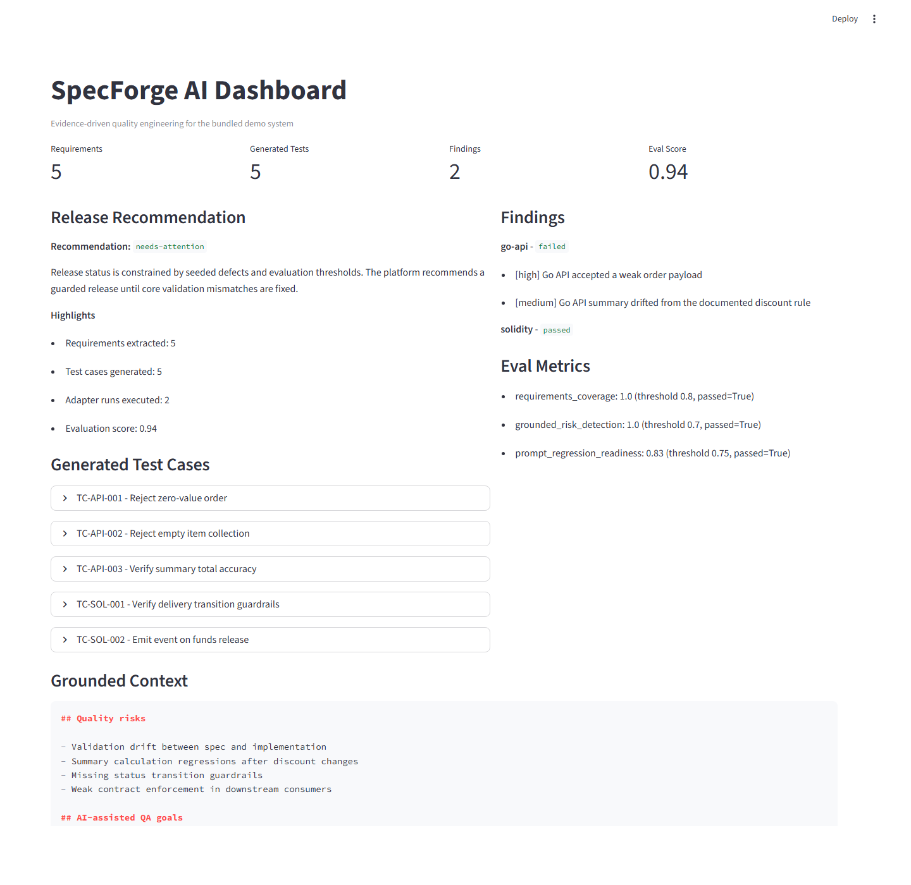
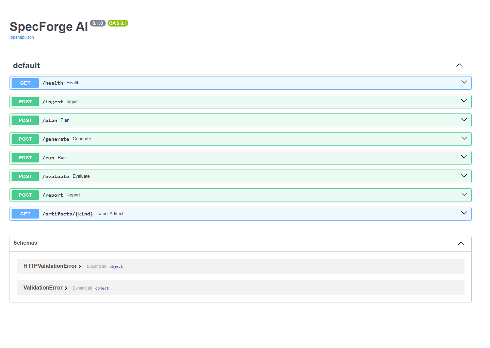

# SpecForge AI

SpecForge AI is a portfolio-ready monorepo for AI-augmented quality engineering, spec-driven development, and agentic testing workflows. It combines a Python orchestration platform, a Go demo API, a Rust mutation engine, a Solidity smart-contract module, prompt evaluations, and an automation showcase with n8n.

## Why this repository exists

This project is designed to demonstrate a hybrid profile:

- Senior QA leadership with modern quality strategy
- AI-native engineering and agentic workflow design
- Polyglot implementation across Python, Go, Rust, and Solidity
- Eval-driven development, RAG, contract testing, and practical automation

## Core capabilities

- Ingest Markdown specs, Gherkin features, OpenAPI contracts, and Solidity artifacts
- Retrieve grounded context with a vector-store abstraction and pgvector-ready configuration
- Generate test strategy, test cases, and release-readiness summaries through provider-agnostic LLM adapters
- Execute API contract checks, Solidity validation, and demo mutation scenarios
- Evaluate prompt and agent quality with rubric-based regression suites
- Surface evidence through a CLI, FastAPI service, Streamlit dashboard, and n8n automation hooks

## Repository structure

```text
.
|-- platform/              Python orchestration core, CLI, API, adapters, tests
|-- dashboard/             Streamlit evidence dashboard
|-- demo/
|   |-- specs/             Product specification, Gherkin feature, OpenAPI contract
|   |-- api-go/            Seeded-defect Go API under test
|   |-- mutator-rust/      Rust-based boundary and adversarial case generator
|   `-- contracts/         Solidity sample, Foundry tests, Hardhat smoke flow
|-- evals/                 Prompts, datasets, rubrics, promptfoo provider shim
|-- n8n/                   Integration showcase workflow
|-- docs/                  Architecture, ADRs, setup, walkthrough
|-- examples/              Sample reports and benchmark artifacts
`-- .github/workflows/     CI pipeline
```

## Architecture

The architecture overview lives in [docs/architecture.md](docs/architecture.md). It explains how specs flow through ingestion, retrieval, generation, execution, evaluation, and reporting.

## Technology rationale

| Technology | Role in the project | Why it belongs here |
| --- | --- | --- |
| Python | Orchestration core, CLI, API, data models | Best fit for AI workflows, QA tooling, and service composition |
| FastAPI | Service layer | Clean async-friendly API for dashboard and integrations |
| Typer | CLI surface | Strong developer UX for portfolio demos and automation |
| Streamlit | Dashboard | Fast way to present evidence, metrics, and generated outputs |
| PostgreSQL + pgvector | Retrieval store | Production-aligned default for grounded QA workflows |
| Go | Demo API under test | Shows contract testing against a performant typed backend |
| Rust | Mutation engine | Demonstrates robustness testing and boundary-focused generation |
| Solidity + Foundry + Hardhat | Smart-contract QA slice | Shows bounded Web3 testing without making the full repo Web3-only |
| promptfoo | Eval-driven development | Makes prompt and agent quality measurable and regression-friendly |
| n8n | Automation showcase | Exposes practical alerting and issue-drafting workflows |

## Seeded defects

The demo system intentionally contains mismatches between product spec and implementation so the platform has something meaningful to detect:

- The Go API accepts weak order payloads that should be rejected
- The order summary endpoint can return inaccurate totals
- Contract status transitions are intentionally too permissive
- The Solidity module is small but includes behaviors that must be checked through state and event assertions

## Validated workflows

This repository has been exercised end-to-end in its current snapshot:

- `uv run pytest` in `platform`
- Full CLI workflow: `ingest -> plan -> generate -> run -> evaluate -> report`
- `npm run eval:ci` with promptfoo regression checks
- `go build ./cmd/server` for the demo API
- `cargo run -- --schema ../specs/openapi.yaml --seed cases/basic-orders.json` for the Rust mutator
- `forge test` for Solidity contract checks
- `npm --prefix hardhat run smoke` for the Hardhat compatibility flow
- `docker compose up --build -d` for the local-first stack
- Live HTTP validation across the demo API, platform API, and dashboard

Artifacts generated through the CLI or Docker Compose are persisted under `artifacts/runs/`.

## Expected demo outcome

The demo is designed to fail safely and visibly. A representative validated run produces:

- 5 extracted requirements
- 5 generated tests
- 2 live findings in the Go API
- An evaluation score around `0.94`
- A `needs-attention` release recommendation

This is expected behavior. The repository intentionally ships with seeded defects so the platform can demonstrate grounded defect detection instead of a synthetic all-green result.

## Quick start

1. Copy `.env.example` to `.env`.
2. Install the required toolchains listed in [docs/setup.md](docs/setup.md).
3. Start local dependencies with Docker Compose.
4. Run the SpecForge CLI against the bundled demo specs.
5. Review the generated evidence in the dashboard and sample reports.

Example workflow:

```bash
cp .env.example .env
docker compose up --build -d
cd platform
uv sync --extra dev
uv run specforge ingest
uv run specforge plan
uv run specforge generate
uv run specforge run
uv run specforge evaluate
uv run specforge report
```

Useful local entry points after the stack is up:

- FastAPI docs: `http://localhost:8000/docs`
- Streamlit dashboard: `http://localhost:8501`
- n8n editor: `http://localhost:5678`

## Screenshots

### Streamlit dashboard



### FastAPI docs



## What to look at first

- [docs/walkthrough.md](docs/walkthrough.md) for the end-to-end story
- [platform/src/specforge_ai/cli.py](platform/src/specforge_ai/cli.py) for the CLI contract
- [demo/specs/product-spec.md](demo/specs/product-spec.md) for the source requirements
- [examples/sample-report.md](examples/sample-report.md) for a benchmark-style evidence snapshot

## Human-in-the-loop workflow

SpecForge AI keeps the runtime provider-agnostic, but explicitly documents how engineers can pair it with:

- Claude for grounded analysis and review loops
- Cursor for code navigation and implementation acceleration
- GitHub Copilot for local developer ergonomics

These tools are treated as optional engineering companions rather than required runtime dependencies.

## Status

This repository is intentionally local-first and portfolio-focused. The current snapshot is validated end-to-end and structured so it can evolve into a production-grade internal QA platform while remaining easy to review as a public portfolio project.