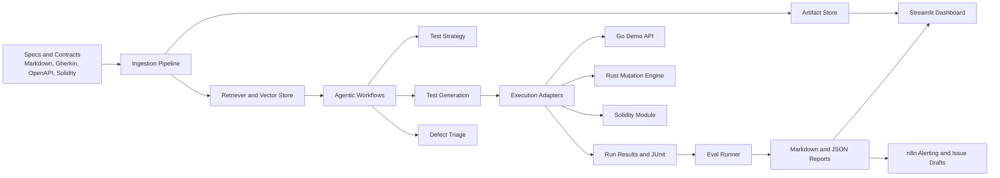

# Architecture

## Design principles

- Local-first by default, with cloud integrations as optional adapters
- Provider-agnostic AI interfaces
- Evidence before opinion, with explicit artifacts and run manifests
- Narrow but real polyglot scope instead of disconnected toy folders
- Strong emphasis on evals and regression-safe prompts

## Main subsystems

### Platform

The Python platform owns ingestion, retrieval, orchestration, reporting, CLI workflows, and the FastAPI service used by the dashboard and automation endpoints.

### Demo targets

The Go API is the main system under test. It is intentionally simple, but includes enough contract and business-rule drift to support meaningful test generation and defect reporting. The Solidity slice is bounded and focused on state transitions and event validation.

### Retrieval and grounding

The retrieval layer is built behind interfaces so the repo can run in a mock or lexical mode for demos, while still targeting PostgreSQL plus pgvector for default local deployment.

### Evaluation

Prompt and agent outputs are evaluated with versioned prompts, fixed datasets, and a small provider shim for local, deterministic checks. This keeps the project reproducible and CI-friendly.

